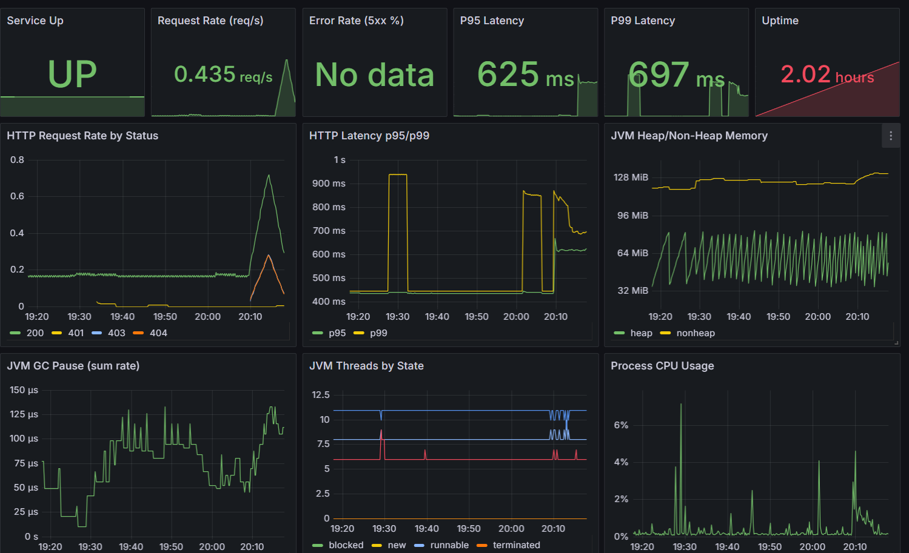
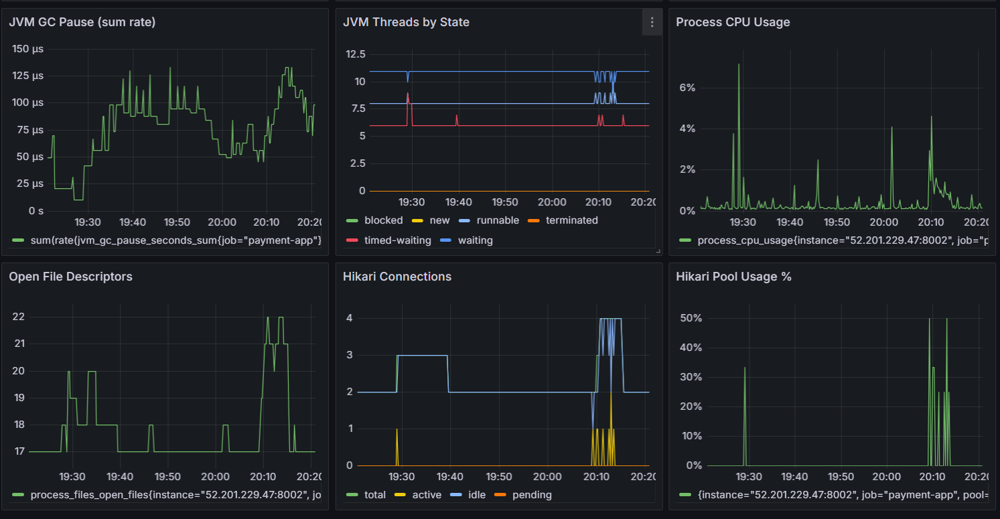
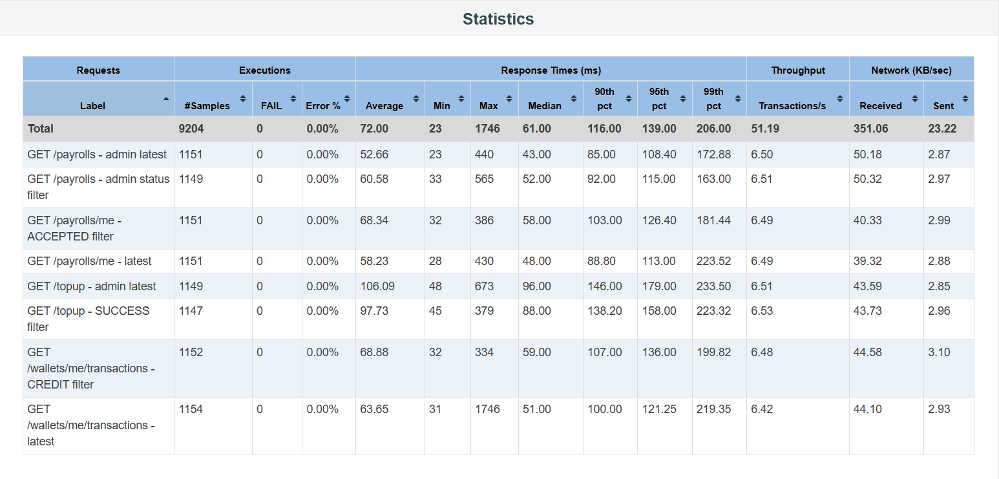
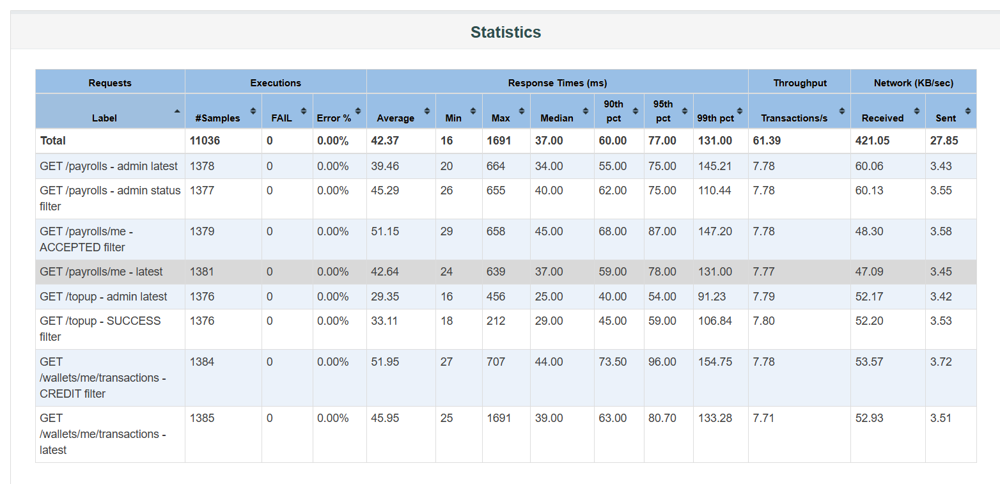
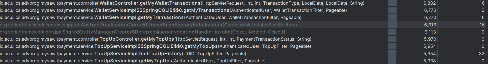
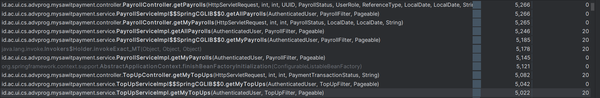

# MySawit Payment - Monitoring dan Profiling

## Monitoring

Monitoring digunakan untuk melihat kondisi production service secara cepat dan untuk membantu mendeteksi masalah performa sebelum berdampak ke pengguna. Service ini mengekspor metrik melalui Spring Actuator dan Micrometer Prometheus.

Endpoint observability:

- `/actuator/health`
- `/actuator/prometheus`

Konfigurasi metrik berada di `src/main/resources/application.properties`, termasuk histogram untuk `http.server.requests` dan SLO latency:

```properties
management.endpoints.web.exposure.include=health,prometheus
management.metrics.distribution.percentiles-histogram.http.server.requests=true
management.metrics.distribution.slo.http.server.requests=100ms,200ms,300ms,500ms,1s,2s,5s
```

### Justifikasi Desain Monitoring

Dashboard monitoring dibuat untuk menjawab tiga pertanyaan utama:

1. **Apakah service masih hidup dan dapat menerima request?**  
   Ini dijawab oleh panel `Service Up`, `Uptime`, dan `Request Rate`.

2. **Apakah pengguna mulai mengalami error atau latency tinggi?**  
   Ini dijawab oleh panel `Error Rate (5xx %)`, `HTTP Request Rate by Status`, `P95 Latency`, `P99 Latency`, dan `HTTP Latency p95/p99`.

3. **Apakah bottleneck berasal dari resource aplikasi atau database connection pool?**  
   Ini dijawab oleh panel `JVM Heap/Non-Heap Memory`, `JVM GC Pause`, `JVM Threads by State`, `Process CPU Usage`, `Open File Descriptors`, `Hikari Connections`, dan `Hikari Pool Usage %`.

Pemilihan p95 dan p99 latency lebih relevan daripada hanya average latency karena payment service harus tetap stabil untuk request yang lambat atau berada di tail latency. Panel Hikari juga penting karena endpoint payment banyak bergantung pada transaksi database, locking, dan query history.

### Bukti Monitoring



Gambar di atas menunjukkan service dalam keadaan `UP`, request rate aktif, tidak ada data error 5xx pada panel tersebut, serta p95/p99 latency yang dapat dipantau sepanjang waktu.



Gambar kedua menunjukkan metrik resource aplikasi dan database connection pool. Panel ini dipakai untuk memastikan kenaikan latency tidak berasal dari tekanan CPU, GC pause, thread state yang tidak sehat, file descriptor, atau pemakaian Hikari pool yang terlalu tinggi.

### Contoh Penggunaan Monitoring

Contoh penggunaan dashboard:

- Jika `Error Rate (5xx %)` naik, developer dapat membuka panel `HTTP Request Rate by Status` untuk melihat status code dominan dan mengecek log endpoint terkait.
- Jika `P95 Latency` atau `P99 Latency` naik, developer dapat membandingkannya dengan `Process CPU Usage`, `JVM GC Pause`, dan `Hikari Pool Usage %`.
- Jika Hikari pool mendekati penuh, dugaan awalnya adalah query lambat, transaksi terlalu lama, atau lock contention pada endpoint payment.
- Jika service `UP` tetapi request rate turun drastis, kemungkinan masalah berada di routing, frontend, gateway, atau traffic source.

## Profiling

Profiling dilakukan untuk mencari endpoint yang layak dioptimasi berdasarkan karakteristik payment service. Endpoint history dipilih karena:

- dipanggil berulang oleh dashboard/frontend;
- membaca data historis yang jumlahnya terus bertambah;
- menggunakan pagination, sorting, dan filter status;
- langsung bergantung pada performa query database.

Fokus optimasi adalah endpoint top-up history:

- `GET /api/v1/topup?page=0&size=20&sort=createdAt,desc`
- `GET /api/v1/topup?page=0&size=20&status=SUCCESS&sort=createdAt,desc`

### Proses Profiling

Profiling dilakukan dengan skenario load test terkontrol menggunakan JMeter. Data seed dibuat agar tabel history memiliki volume data yang cukup untuk menampilkan biaya query sorting/filtering.

Artifact yang digunakan:

- `profiling/payment-history-loadtest.jmx`
- `profiling/before.jtl`
- `profiling/after.jtl`
- `profiling/report-before/statistics.json`
- `profiling/report-after/statistics.json`
- `profiling/seed-payment-loadtest.sql`

Screenshot JMeter report:





Sampling profiler juga digunakan untuk melihat jalur kode yang aktif ketika endpoint history dipanggil.





### Analisis Sebelum Optimasi

Sebelum optimasi, endpoint top-up history masih lebih lambat dibanding endpoint history lain. Dari JMeter report:

| Skenario | Average Before | P95 Before | P99 Before |
| --- | ---: | ---: | ---: |
| `GET /topup - admin latest` | 106.09 ms | 179.00 ms | 233.50 ms |
| `GET /topup - SUCCESS filter` | 97.73 ms | 158.00 ms | 223.32 ms |

Masalah utamanya adalah akses history top-up perlu membaca data berdasarkan `admin_id`, optional `status`, dan sorting `created_at DESC`. Pola ini membutuhkan query path dan index yang sesuai, terutama saat data payment transaction bertambah.

### Optimasi yang Dilakukan

Optimasi dilakukan di dua sisi:

1. **Kode repository/service**  
   Query history top-up dibuat lebih eksplisit melalui method repository khusus:
   - `findByAdminIdOrderByCreatedAtDesc`
   - `findByAdminIdAndStatusOrderByCreatedAtDesc`

2. **Database index**  
   Ditambahkan composite index untuk pola query top-up history:
   - `idx_pt_admin_created_desc`
   - `idx_pt_admin_status_created_desc`

Migration:

```text
src/main/resources/db/migration/V11__add_payment_history_indexes.sql
```

### Hasil Improvement

Hasil profiling before dan after:

| Skenario | Average Before | Average After | Improvement |
| --- | ---: | ---: | ---: |
| `GET /topup - admin latest` | 106.09 ms | 29.35 ms | 72.34% |
| `GET /topup - SUCCESS filter` | 97.73 ms | 33.11 ms | 66.12% |

Analisis p95 juga menunjukkan improvement yang besar:

| Skenario | P95 Before | P95 After | Improvement |
| --- | ---: | ---: | ---: |
| `GET /topup - admin latest` | 179.00 ms | 54.00 ms | 69.83% |
| `GET /topup - SUCCESS filter` | 158.00 ms | 59.00 ms | 62.66% |

Total rata-rata seluruh skenario load test turun dari `72.00 ms` menjadi `42.37 ms`, tetapi klaim utama optimasi adalah pada fungsi critical top-up history karena dua skenario tersebut mencapai improvement di atas 50%.

## Kesimpulan

Monitoring digunakan untuk menjaga observability production service melalui metrik availability, request rate, error rate, latency, JVM resource, CPU, dan database connection pool. Profiling digunakan untuk menemukan bottleneck pada endpoint history yang kritikal, lalu ditindaklanjuti dengan optimasi query path dan database index.

Hasil akhirnya, endpoint top-up history menunjukkan improvement average response time sebesar **72.34%** untuk latest history dan **66.12%** untuk filter `SUCCESS`.
